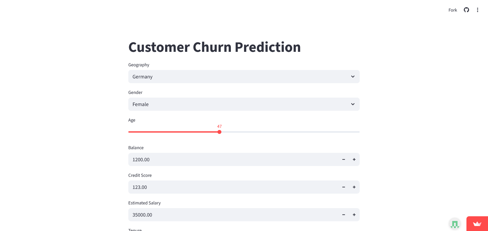

# 🎯 Customer Churn Prediction

A deep learning project that predicts customer churn using an Artificial Neural Network (ANN) model built with TensorFlow/Keras. The project includes a complete end-to-end pipeline from data preprocessing to model deployment via a Streamlit web application.


## 📋 Table of Contents

- [Overview](#overview)
- [Features](#features)
- [Project Architecture](#project-architecture)
- [Dataset](#dataset)
- [Installation](#installation)
- [Usage](#usage)
- [Model Architecture](#model-architecture)
- [Project Structure](#project-structure)
- [Results](#results)
- [Technologies Used](#technologies-used)
- [License](#license)

## 🔍 Overview

Customer churn prediction is crucial for businesses to identify customers who are likely to discontinue their services. This project implements a binary classification model using Artificial Neural Networks to predict whether a customer will churn based on various features like credit score, geography, age, balance, and more.

The model achieves approximately **86% accuracy** on the validation set and is deployed as an interactive web application using Streamlit.

## ✨ Features

- **Deep Learning Model**: Custom ANN architecture with multiple dense layers
- **Data Preprocessing Pipeline**: Automated encoding and scaling of features
- **Interactive Web App**: User-friendly Streamlit interface for real-time predictions
- **Model Persistence**: Saved model and preprocessors for consistent predictions
- **Comprehensive Notebooks**: Detailed Jupyter notebooks for training and testing
- **Visualization**: TensorBoard integration for training monitoring

## 🏗️ Project Architecture


The project follows a complete end-to-end machine learning pipeline:

1. **Data Source**: Raw customer data from CSV file (10,000 records)
2. **Data Preprocessing**: Feature engineering, encoding, and scaling
3. **Model Training**: ANN training with TensorFlow/Keras
4. **Trained Artifacts**: Saved model and preprocessor objects
5. **Prediction Pipeline**: Inference logic for new predictions
6. **Web Application**: Interactive Streamlit deployment

For a detailed visual architecture diagram, open the `churn_prediction_architecture.html` file in your browser.

## 📊 Dataset

The project uses the **Churn_Modelling.csv** dataset containing 10,000 customer records with the following features:

### Input Features (12 after preprocessing):
- **CreditScore**: Customer's credit score
- **Geography**: Customer's location (France, Germany, Spain)
- **Gender**: Male or Female
- **Age**: Customer's age
- **Tenure**: Years with the bank
- **Balance**: Account balance
- **NumOfProducts**: Number of products used
- **HasCrCard**: Has credit card (0/1)
- **IsActiveMember**: Active membership status (0/1)
- **EstimatedSalary**: Estimated annual salary

### Target Variable:
- **Exited**: Whether the customer churned (0 = No, 1 = Yes)

### Dropped Features:
- RowNumber, CustomerId, Surname (non-predictive identifiers)

## 🚀 Installation

### Prerequisites
- Python 3.8 or higher
- pip package manager

### Setup Instructions

1. **Clone the repository**
```bash
git clone https://github.com/yourusername/customer-churn-prediction.git
cd customer-churn-prediction
```

2. **Create a virtual environment**
```bash
python -m venv venv
source venv/bin/activate  # On Windows: venv\Scripts\activate
```

3. **Install required packages**
```bash
pip install -r requirements.txt
```

4. **Required Dependencies**
```
tensorflow
streamlit
pandas
numpy
scikit-learn
pickle
```

## 💻 Usage

### Training the Model

Run the training notebook to train the model from scratch:

```bash
jupyter notebook experiments.ipynb
```

This will:
- Load and preprocess the data
- Train the ANN model
- Save the trained model as `model.h5`
- Save encoders and scaler as pickle files

### Testing Predictions

Test the prediction pipeline:

```bash
jupyter notebook prediction.ipynb
```

### Running the Web Application

Launch the Streamlit app:

```bash
streamlit run app.py
```

The app will open in your browser at `http://localhost:8501`

### Making Predictions

1. Open the Streamlit application
2. Select/input customer features:
   - Geography (France/Germany/Spain)
   - Gender (Male/Female)
   - Age (18-92)
   - Balance
   - Credit Score
   - Estimated Salary
   - Tenure (0-10 years)
   - Number of Products (1-4)
   - Has Credit Card (Yes/No)
   - Active Member Status (Yes/No)
3. Click to get churn probability
4. View prediction result (Likely to Churn / Not Likely to Churn)

## 📁 Project Structure

```
customer-churn-prediction/
│
├── app.py                          # Streamlit web application
├── experiments.ipynb               # Model training notebook
├── prediction.ipynb                # Prediction testing notebook
├── Churn_Modelling.csv            # Dataset
│
├── model.h5                        # Trained neural network model
├── label_encoder_gender.pkl        # Gender label encoder
├── onehot_encoder_geo.pkl         # Geography one-hot encoder
├── scaler.pkl                      # Feature scaler
│
├── requirements.txt                # Python dependencies
├── README.md                       # Project documentation
└── logs/                          # TensorBoard logs
    └── fit/
```

## 📈 Results

### Model Training Results

| Metric | Training | Validation |
|--------|----------|------------|
| Accuracy | 87.15% | 86.30% |
| Loss | 0.3151 | 0.3389 |

### Sample Prediction




## 🔧 Troubleshooting & Common Errors

### 1. Missing `scaler.pkl` File

**Error:**
```
FileNotFoundError: [Errno 2] No such file or directory: 'scaler.pkl'
```

**Solution:**
The `scaler.pkl` file is created during model training in `experiments.ipynb`. Make sure to:
- Run the complete `experiments.ipynb` notebook
- Check that the scaler is saved with this code:
```python
with open('scaler.pkl', 'wb') as file:
    pickle.dump(scaler, file)
```

### 2. TensorFlow/Keras Version Compatibility

**Error:**
```
AttributeError: module 'tensorflow.keras' has no attribute 'Sequential'
```

**Solution:**
- Ensure TensorFlow 2.x is installed: `pip install tensorflow==2.15.0`

### 3. Model Loading Warning

**Warning:**
```
WARNING:absl:Compiled the loaded model, but the compiled metrics have yet to be built.
```

**Solution:**
This is a normal warning and doesn't affect predictions. The model will work correctly. To suppress it, you can compile the model after loading:
```python
model = load_model('model.h5')
model.compile(optimizer='adam', loss='binary_crossentropy', metrics=['accuracy'])
```

### 4. Streamlit Port Already in Use

**Error:**
```
OSError: [Errno 48] Address already in use
```

**Solution:**
```bash
# Kill the process using port 8501
lsof -ti:8501 | xargs kill -9

# Or run on a different port
streamlit run app.py --server.port 8502
```

### 5. Feature Names Warning in OneHotEncoder

**Warning:**
```
UserWarning: X does not have valid feature names, but OneHotEncoder was fitted with feature names
```

**Solution:**
This occurs when passing list instead of DataFrame. Wrap input in proper format:
```python
# Instead of: onehot_encoder_geo.transform([['France']])
# Use: onehot_encoder_geo.transform(pd.DataFrame([['France']], columns=['Geography']))
```

### 6. NumPy Version Compatibility

**Error:**
```
FutureWarning: In the future `np.object` will be defined as the corresponding NumPy scalar.
```

**Solution:**
- Downgrade NumPy: `pip install numpy==1.23.5`
- Or upgrade TensorFlow to the latest version

### 7. Input Shape Mismatch

**Error:**
```
ValueError: Input 0 of layer "sequential" is incompatible with the layer: expected shape=(None, 12), found shape=(None, 11)
```

**Solution:**
Ensure all 12 features are present in correct order:
1. CreditScore
2. Gender (encoded)
3. Age
4. Tenure
5. Balance
6. NumOfProducts
7. HasCrCard
8. IsActiveMember
9. EstimatedSalary
10. Geography_France
11. Geography_Germany
12. Geography_Spain

## 💡 Tips for Success

1. **Always run `experiments.ipynb` first** to generate all required files
2. **Keep Python version consistent** across training and deployment
3. **Save all preprocessing objects** (encoders, scalers) during training
4. **Use virtual environment** to avoid dependency conflicts
5. **Check file paths** - ensure all pickle files are in the same directory as scripts
6. **Test predictions locally** before deploying to web app
7. **Monitor TensorBoard** during training to catch issues early

## 🛠️ Technologies Used

### Machine Learning & Deep Learning
- **TensorFlow/Keras**: Neural network framework
- **scikit-learn**: Data preprocessing and encoding

### Data Processing
- **Pandas**: Data manipulation and analysis
- **NumPy**: Numerical computations

### Web Framework
- **Streamlit**: Interactive web application

### Visualization & Monitoring
- **TensorBoard**: Training visualization
- **Matplotlib/Seaborn**: Data visualization (in notebooks)

### Model Persistence
- **Pickle**: Saving encoders and scalers
- **HDF5**: Saving neural network model

## 🔄 Data Preprocessing Pipeline

1. **Load Data**: Read CSV file with pandas
2. **Feature Selection**: Remove non-predictive columns
3. **Encoding**:
   - Label Encoding for Gender (Male=1, Female=0)
   - One-Hot Encoding for Geography (3 dummy variables)
4. **Scaling**: StandardScaler for numerical features
5. **Train-Test Split**: 80-20 split for training and validation

## 🎨 Web Application Features

- **User-Friendly Interface**: Clean and intuitive design
- **Real-time Predictions**: Instant churn probability calculation
- **Interactive Inputs**: Dropdowns, sliders, and number inputs
- **Clear Results**: Visual feedback on prediction outcome
- **Responsive Design**: Works on desktop and mobile devices

## 🔮 Future Enhancements

- [ ] Implement model explainability (SHAP values)
- [ ] Add feature importance visualization
- [ ] Deploy to cloud platform (AWS/Azure/GCP)
- [ ] Add batch prediction capability
- [ ] Implement A/B testing framework
- [ ] Add model retraining pipeline
- [ ] Create REST API endpoint
- [ ] Add authentication and user management
- [ ] Implement MLOps best practices
- [ ] Add model monitoring and drift detection

## 📝 License

This project is licensed under the MIT License - see the [LICENSE](LICENSE) file for details.

## 👤 Author

**Pinki**

## 🙏 Acknowledgments

- Dataset source: [Kaggle/Source]
- TensorFlow and Keras documentation
- Streamlit community
- scikit-learn contributors

## 📞 Contact

For questions, feedback, or collaboration opportunities, please reach out:

- 📧 Email: pinkidagar18@gmail.com

---

**⭐ If you found this project helpful, please give it a star!**

---

## 📚 Additional Resources

- [TensorFlow Documentation](https://www.tensorflow.org/)
- [Streamlit Documentation](https://docs.streamlit.io/)
- [Customer Churn Analysis Guide](https://example.com)
- [Deep Learning Best Practices](https://example.com)

---
